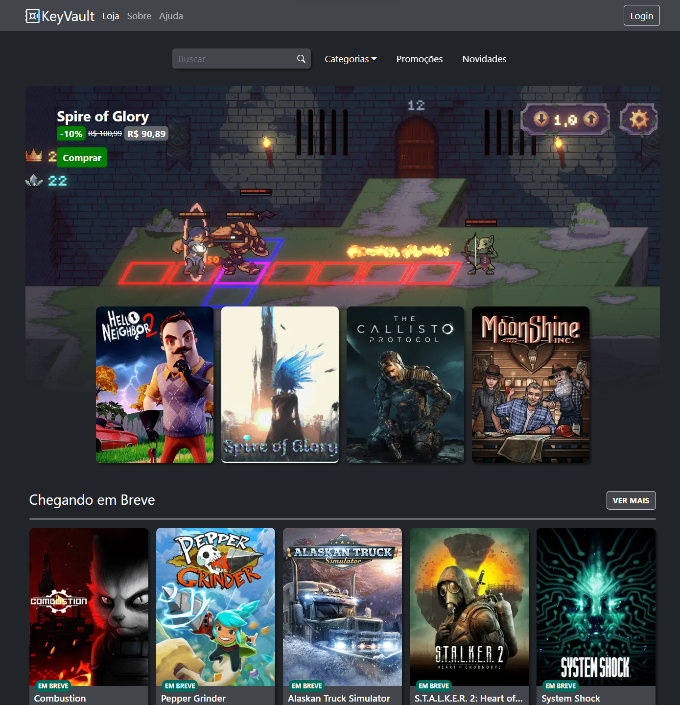
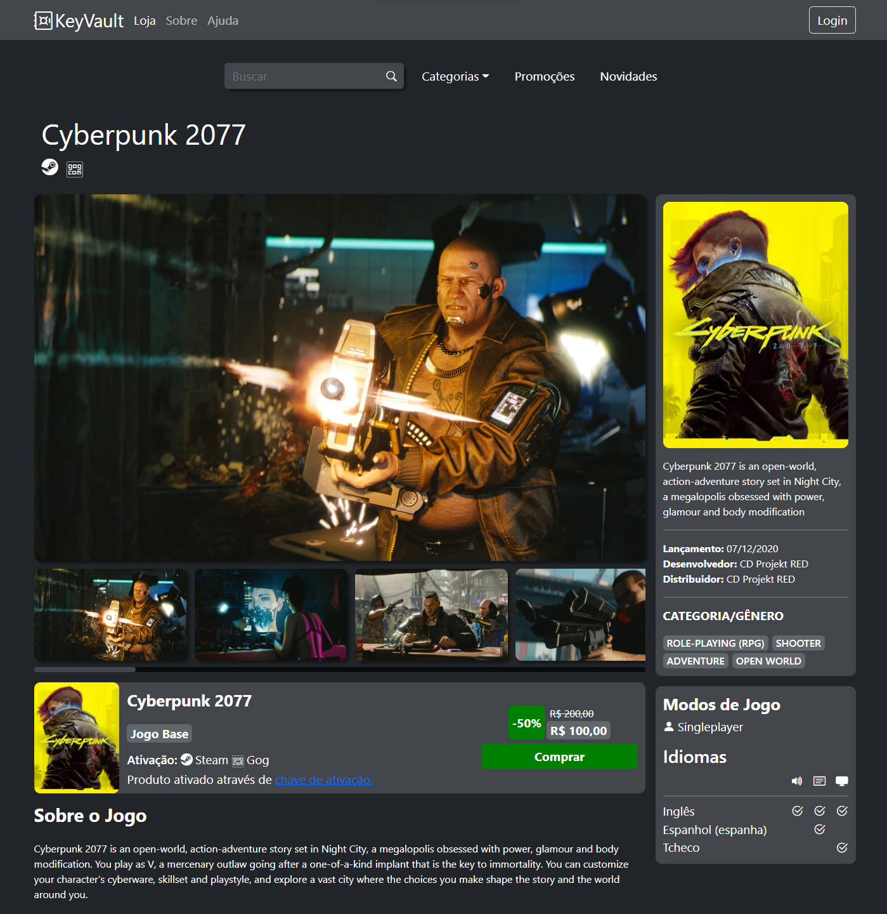
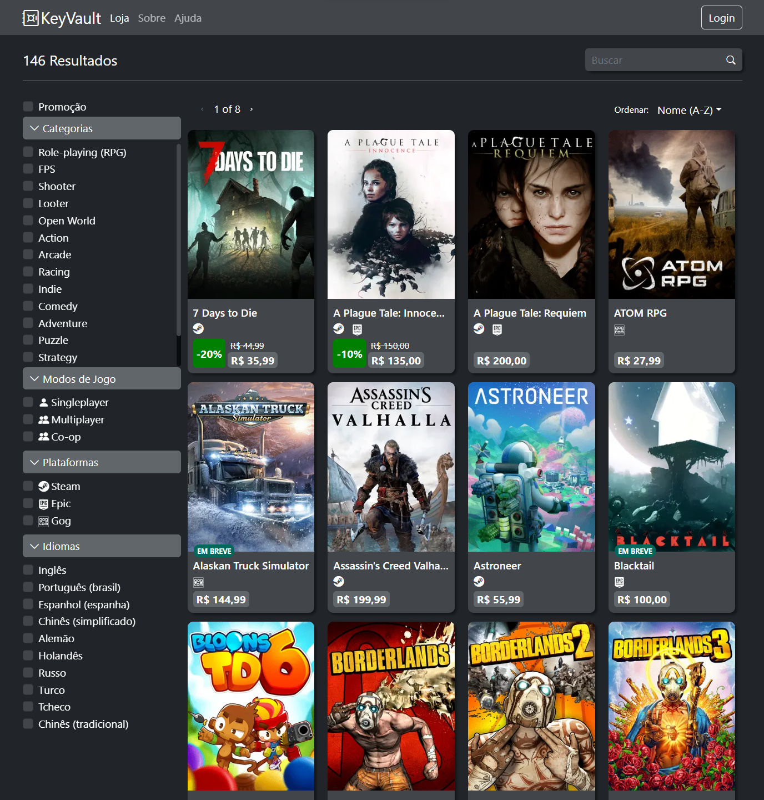
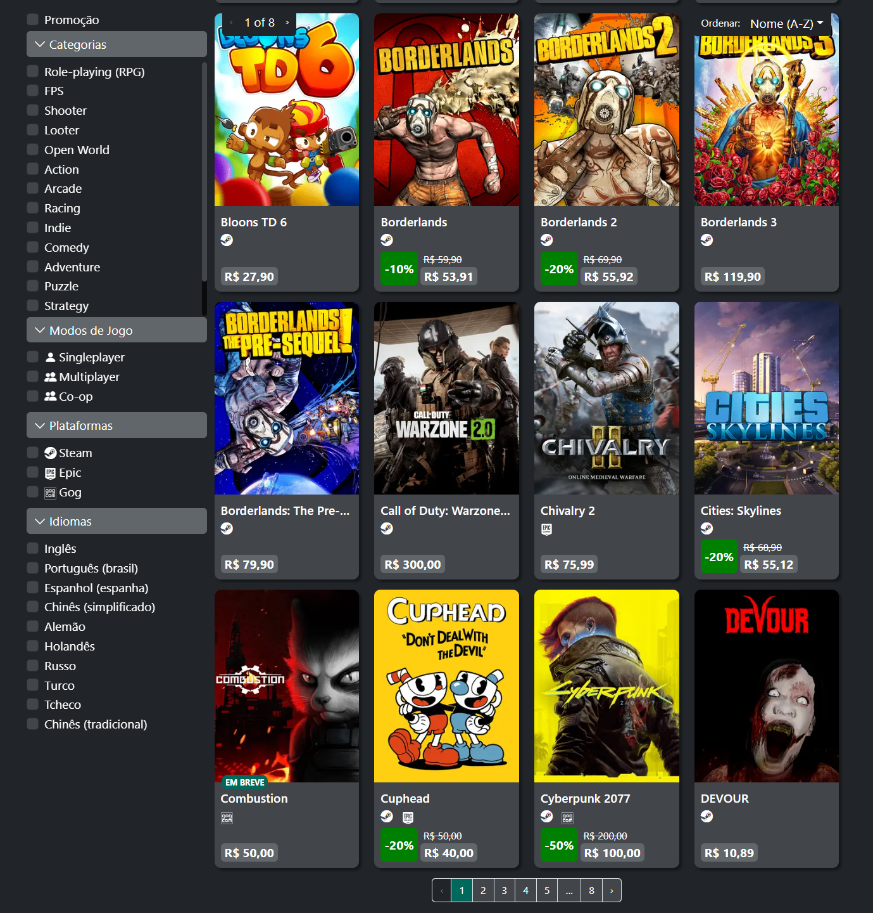
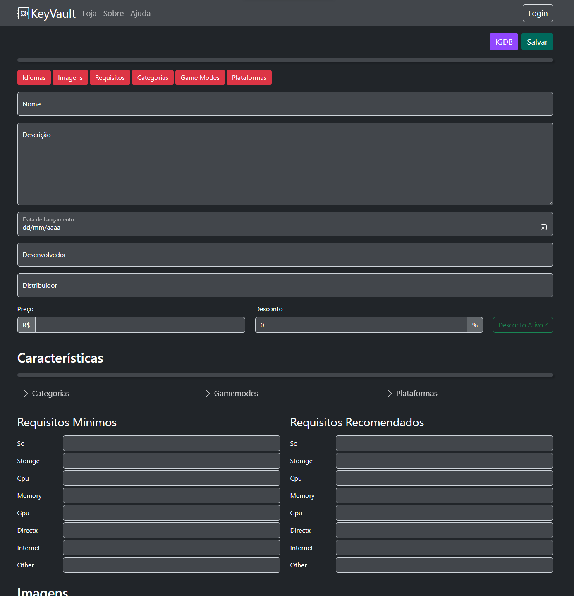
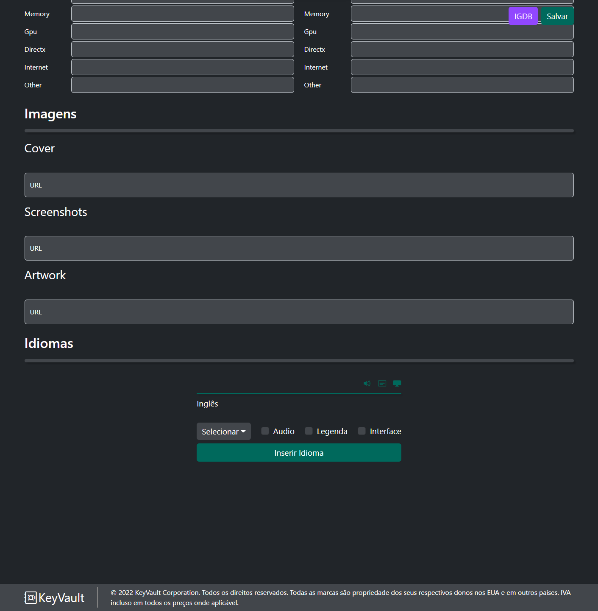
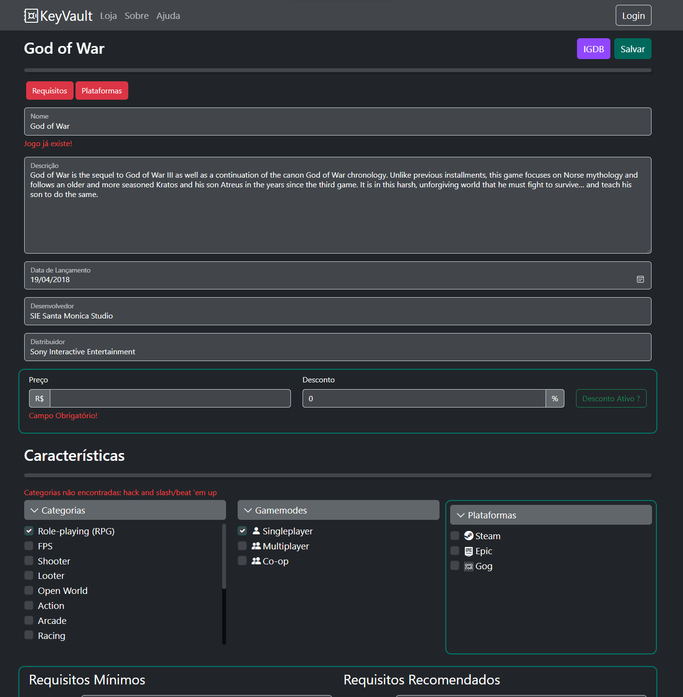
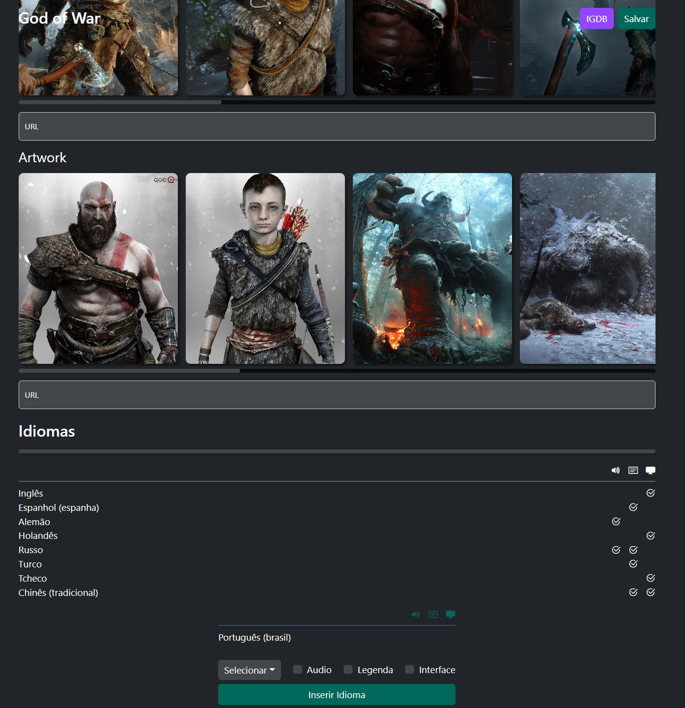
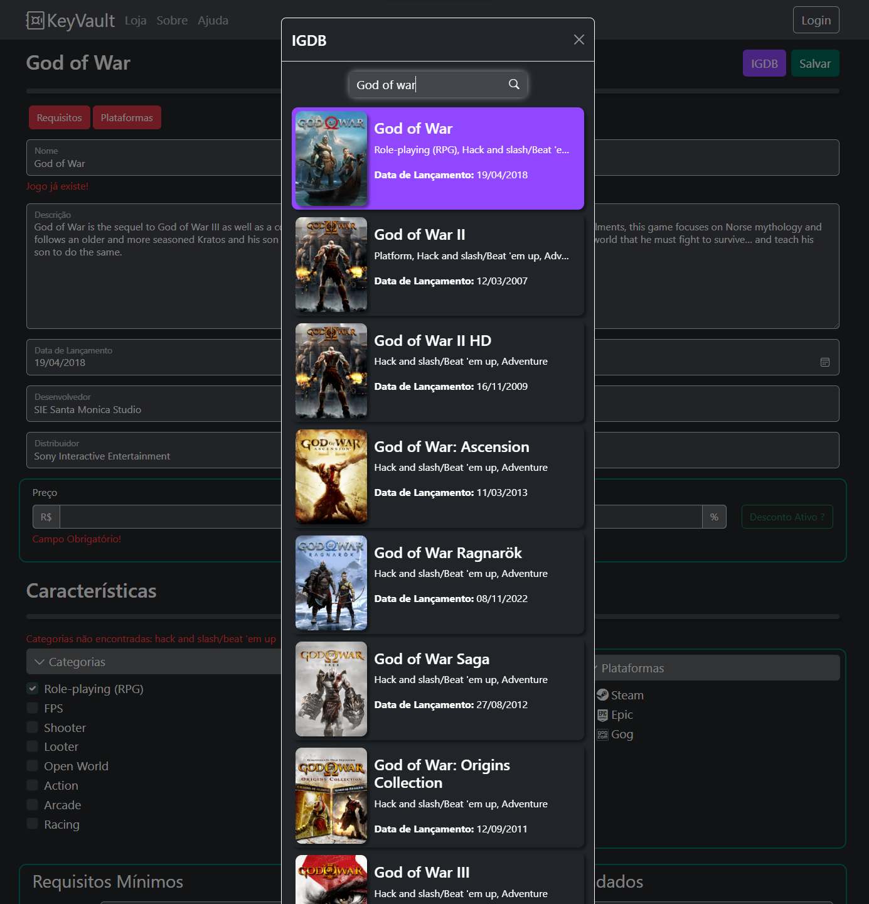

# Key Vault

A Game Store Project

## Gallery
<p align=center>
  
  ### Home Page
  
  
  
  ### Game Page
  
  
  
  ### Game Search Page (Superior)
  
  
  
  ### Game Search Page (Inferior)
  
  
  
  ### Game Admin Page (Superior)
  
  
  
  ### Game Admin Page (Inferior)
  
  
  
  ### Game Admin Page (Filled Superior)
  
  
  
  ### Game Admin Page (Filled Inferior)
  
  
  
  ### Game Admin Page IGDB Modal
  
  
  
</p>

## How to Run This Project

First, install the dependencies:

```bash
npm install
```

Run the development server:

```bash
npx next dev
```

Open [http://localhost:3000](http://localhost:3000) with your browser to see the result.

### Local Env Variables

In order to use the IGDB integration:

First, create a file inside the project's root called .env.local

Then put the following env variables inside .env.local

```bash
TWITCH_CLIENT_ID # Your twitch client ID
TWITCH_ACCESS_TOKEN # Your twitch access token
```

For more information: https://api-docs.igdb.com/#about
